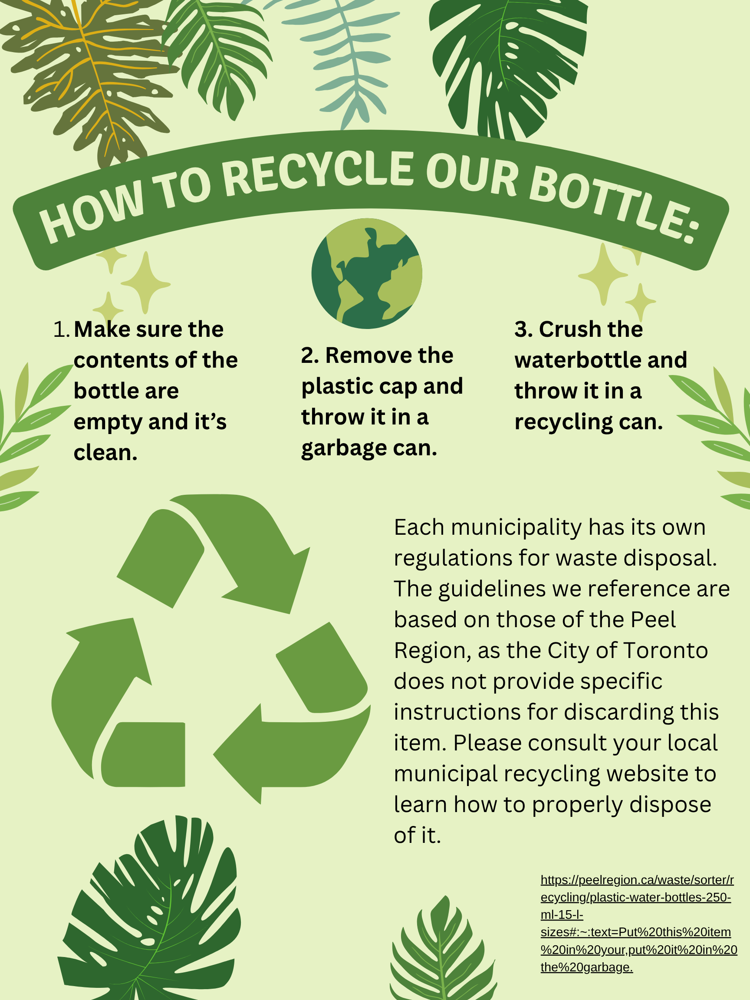

<!-- Chat UI -->

  

    <h3 id="chat-title" style="font-size: 20px;">Chat with Josh</h3>
    
<i class="fa fa-times"></i>

  

  

    <!-- Messages will appear here -->
  

  

    <input id="chat-input" placeholder="Enter your message..." type="text" />
    <i class="send far fa-paper-plane" id="send-button"></i>
  

  

